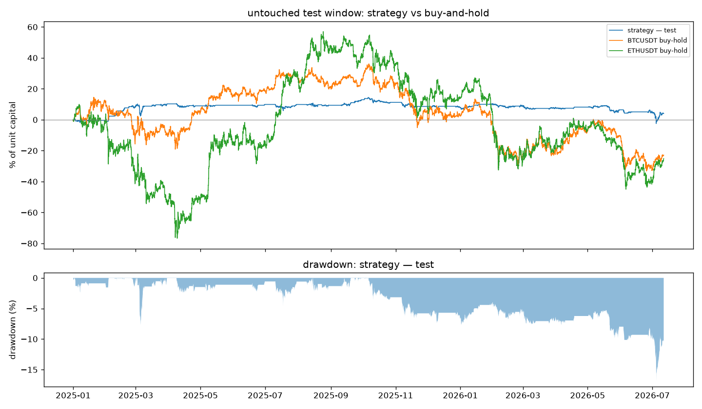
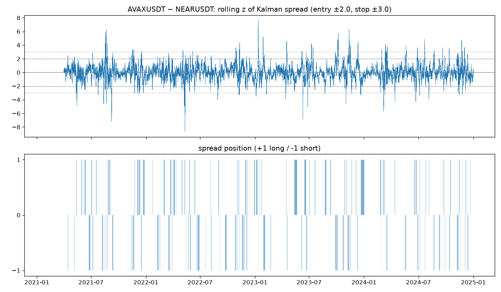
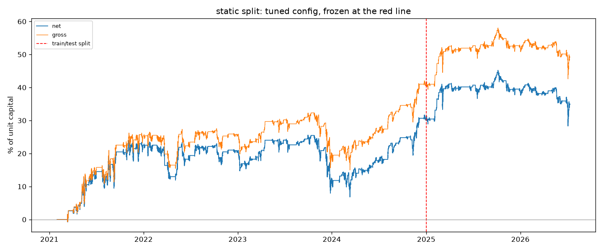
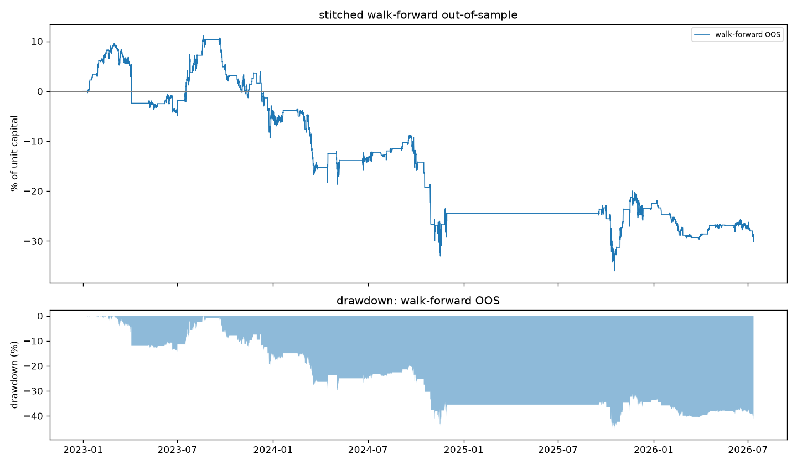
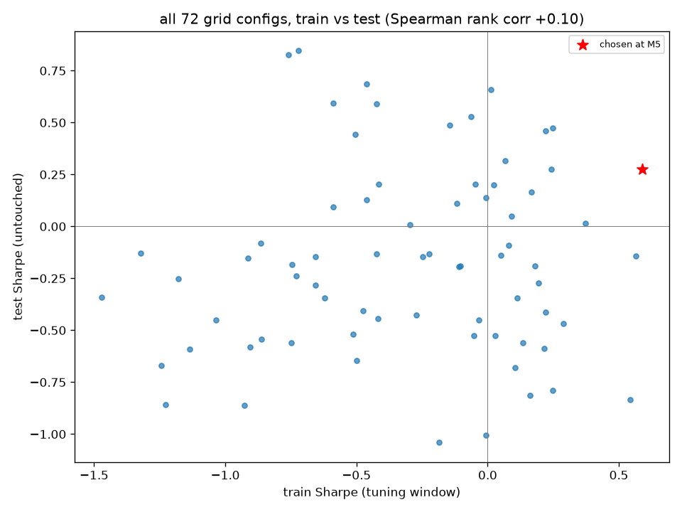
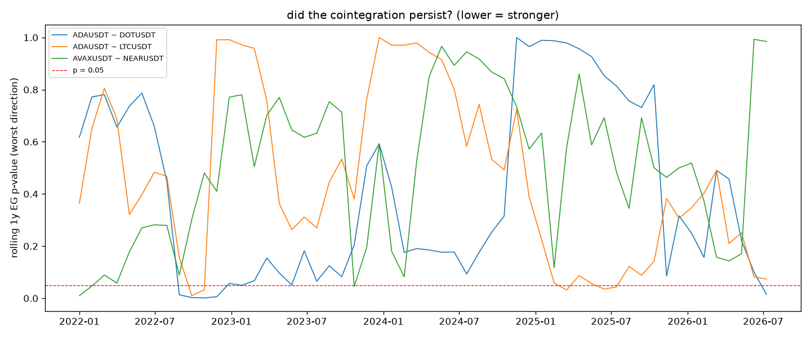
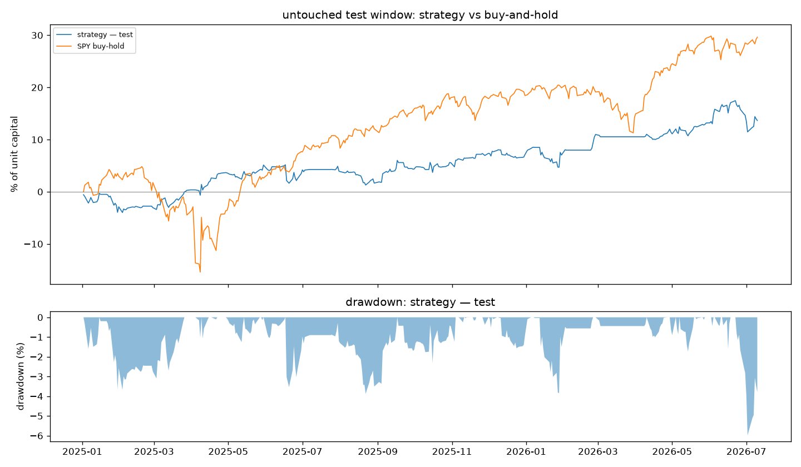

# crypto-statarb

A cross-asset statistical-arbitrage research study — crypto perpetual futures, then a
pre-registered replication on US equities: pairs selected by **cointegration** (not
correlation), a **time-varying hedge ratio** estimated with a Kalman filter, a **z-score
spread strategy** backtested with real frictions (taker fees, slippage, actual funding
payments — or spread + short borrow for equities), and validated **out-of-sample** two
ways — a frozen train/test split and a fully-automated quarterly walk-forward.

**The headline is the in-sample / out-of-sample gap, reported honestly:**

| | net PnL | Sharpe | max DD |
|---|---|---|---|
| Train, 2021–2024 (parameters tuned here) | +30.8% | +0.59 | −18.7% |
| **Test, 2025 – mid-2026 (untouched until the end)** | **+4.0%** | **+0.27** | −16.9% |
| Walk-forward, re-screened + re-tuned quarterly, 2023 – mid-2026 | **−30.2%** | −0.69 | −47.1% |
| BTC buy-and-hold over the same test window | −22.9% | −0.33 | — |

The curated book made +4% net while BTC and ETH lost 23–25% — and Section 5 stress-tests
that number until most of it dissolves. Every figure and table regenerates from raw data
with one command (`make all`); nothing here is the best cell of a search.



---

## 1. Problem

Do crypto perps offer exploitable pairwise mean reversion once you pay real costs — and
does anything found in-sample survive out-of-sample? Crypto is a natural place to look
(shared sector flows, retail-driven dislocations, 24/7 data) and a natural place to fool
yourself (short history, regime changes, correlated everything). The project treats the
second problem as the interesting one: the validation protocol matters more than the
strategy, and negative results are reported as results.

## 2. Data

- **Source:** Binance USDT-margined perpetuals — 1h OHLCV, funding-rate events, and premium
  index, ingested into Postgres by `src/ingest/` (idempotent upserts, gap detection, the
  still-forming bar dropped so no partial data ever enters).
- **Window:** 2021-01-01 → 2026-07-11; 14 liquid alt/major symbols → 91 candidate pairs.
- **Funding is real, not approximated:** PnL uses actual stored funding events (cadence
  varies — e.g. SOL paid 2-hourly during the FTX collapse), floored to the bar they land in.
- **Known bias, documented:** the universe comes from today's `exchangeInfo`, so coins
  delisted before mid-2026 could never enter — survivorship at the universe level
  (`data_provenance.md`).

Raw data is never committed; `make all` rebuilds the database from the exchange API.

## 3. Method

Five steps, each behind a milestone gate with its own report in `reports/`:

1. **Pair screen (train data only).** Engle–Granger cointegration on log closes, run in
   *both* regression directions and screened on the **worse** p-value, plus an AR(1)
   half-life filter (1–30 days). Result: **1 of 91 pairs passed** — correlation is
   abundant, cointegration is rare. The traded book (AVAX/NEAR, ADA/DOT, ADA/LTC) took the
   screen's top three under relaxed bounds, an explicit discretionary step recorded in
   `DECISIONS.md`. With 91 tests at α = 0.05, ~4.5 passes are expected by luck — the screen
   is a candidate filter, and the real arbiter is out-of-sample PnL.
2. **Time-varying hedge ratio.** A hand-rolled Kalman filter (random-walk α, β state)
   replaces static OLS. The spread traded is the *innovation*: today's price minus
   yesterday's hedge prediction — strictly causal by construction. Key finding: at the
   textbook adaptation speed the filter **whitens away the very mean reversion the screen
   found**; the grid later chose a 100× slower filter, and that fragility is reported, not
   hidden (Section 5).
3. **Signal.** Rolling z-score of the innovation (30-day window): enter at |z| ≥ 2.5, exit
   at 0.5, stop and dis-arm beyond 4.0. Positions are 1:β dollar-hedged, frozen at entry,
   and **execute one bar after the signal** — a bar's close can never buy itself.
4. **Costs.** 5 bps taker fee + 2 bps slippage per leg per side, plus actual funding
   transfers. The decomposition is exactly additive: net = gross − fees − slippage + funding.
   Costs run ~4–5% of capital per year at the book's ~39× annual turnover — same order as
   the edge itself.
5. **Validation.** All parameters live in a pre-declared 72-config grid (`config.yaml`)
   tuned only on 2021–2024; 2025+ stayed untouched until the very end. Alongside the frozen
   split, a **fully-automated walk-forward** re-screens pairs and re-tunes quarterly on a
   rolling 2-year window — the honest test of whether the *pipeline*, not the curated book,
   has an edge.

**Look-ahead discipline:** every rolling statistic and fit is covered by
mutate-the-future tests — perturb data after bar *t*, assert bit-identical outputs at *t*
(58 tests, `uv run pytest`).



## 4. Results

**Frozen split.** Train Sharpe +0.59 → test Sharpe +0.27; +4.0% net over 18 untouched
months in which BTC fell 22.9% and ETH 25.1%. Hit rate held at 60% on both sides of the
split; the decay shows up as gross edge shrinking toward the cost floor.



**Walk-forward.** The automated pipeline — same signals, engine, and costs, but
re-screening and re-tuning quarterly with no human in the loop — lost **−30.2% over 3.5
years** (12 traded folds, 3 correctly held cash when nothing passed). Books were unstable
fold to fold, and the worst fold was short a DOGE spread through the November-2024 meme
rally.



**The conclusion the two results force:** what edge exists came from the *human curation
step* at pair selection — the one part that doesn't scale and can't be validated
statistically. The automated version of the same idea loses money.

## 5. Robustness — how the +4% holds up (mostly, it doesn't)

Post-hoc stresses on the frozen config, full tables in `reports/m7_robustness.md`:

- **Costs: the edge dies at 2× fees** (+4.0% → −0.2%; −4.3% at 3×). Maker execution or
  lower turnover isn't an optimization — it's existential.
- **Tuning was mostly luck.** Spearman rank correlation between train and test Sharpe
  across all 72 configs: **+0.10**. The best test config had a *negative* train Sharpe.
- **One pair carried everything.** Leave-one-pair-out: remove ADA/LTC and the test window
  nets **−0.24%**.
- **"Market-neutral" wasn't, in PnL terms.** Dollar-hedged per position, yet the test
  window splits **+11.5% in trailing-BTC-up regimes vs −7.2% in BTC-down** — alt mean
  reversion held when the sector ground up and broke when it sold off together.
  Dollar-neutrality is not factor-neutrality.
- **Cointegration is episodic.** The book pairs pass a rolling 1-year Engle–Granger in only
  **5–11% of windows** (2022–2026) — and ADA/LTC's single strong episode is exactly the
  profitable Q1-2025 window. The full-sample screen detected an average property that
  rarely holds in any given year.




The complete hand-written failure analysis — seven negative findings, each backed by a
table in this repo — is `reports/m7_failure_analysis.md`.

## 6. Limitations

- **Survivorship** in the symbol universe (delisted coins never enter).
- **Multiple testing:** 91 pairs at 5%, compounded across walk-forward folds.
- **Execution model:** 1h bars, next-bar fills, flat bps slippage, no intrabar stop-outs
  (a 3σ spike inside a bar is invisible), no margin or liquidation modelling.
- **No borrow frictions** beyond funding.
- All accounting is arithmetic on constant unit capital — deliberately simple and exactly
  additive, but it ignores compounding.

## 7. Next steps (hypotheses, not claims)

- **Price entries off round-trip cost** and quote maker-side — the cost stress says this is
  the highest-leverage dial.
- **Basket / cross-sectional stat-arb** instead of bilateral pairs — episodic pairwise
  cointegration suggests a common-factor structure that pairs capture badly.
- **A sector-factor regime gate**, given the BTC-regime split above.
- **Paper-trade forward** and compare realised vs backtested PnL (implementation shortfall).

Each would be a training-window experiment first, under the same rules as everything here.

## 8. The equity replication (M10) — same pipeline, second asset class

The whole pipeline re-ran on **24 US large-caps (276 pairs, daily bars,
2021–2026, same split)** under a pre-registered plan (`M10_PLAN.md`) with three
hypotheses committed before any data was pulled — and the book selected by a
**mechanical top-3 rule instead of human curation**, deliberately removing the
step M7 credited with the crypto edge. Verdicts (`reports/m10_crossasset.md`):

- **Prevalence (H1):** 13/276 pairs pass vs crypto's 1/91 — but ~13.8 passes
  were expected by luck. Neither market beats its multiple-testing base rate.
- **Stability (H2): refuted.** Rolling 1y cointegration pass rates were **0–4%**
  vs crypto's 5–11% — equity cointegration was *more* episodic, not less.
- **Profitability (H3):** the untouched test window looks great (+13.7% net,
  Sharpe +1.02) and the diagnostics take it apart: the grid's train→test rank
  correlation was **−0.30**, 97% of configs were positive OOS (a generous tape,
  not a found edge), the one economically-sensible pair (MA~V) *lost* money
  while the two luck-candidates printed — and **SPY buy-and-hold beat the book
  risk-adjusted** (+1.11 vs +1.02).
- The fairest cross-market comparator, the automated walk-forward: crypto
  **−30.2%** → equities **+3.3%** (Sharpe +0.12) over 3.5 years. Thin equity
  frictions stop the bleeding (the edge survives 3× costs, unlike crypto's
  death at 2×) — and the pipeline still earns ~nothing. The v1 conclusion
  generalizes: **it manufactures candidates, not edge, in both asset classes.**



## 9. Reproduce

```bash
cp .env.example .env   # local Postgres credentials
make all               # ingest → tests → M2…M7 → every table and figure
```

Requires Docker (Postgres 16 on host port 5433) and [uv](https://docs.astral.sh/uv/); Python 3.11+.
Ingestion pulls ~5.5 years of 1h data from Binance (~40 min at polite rate limits) and the
validation stage runs the grid + walk-forward (~2 h). Individual stages: `make ingest`,
`make pairs`, `make signals`, `make backtest`, `make validate`, `make metrics`, `make report`.
The equity study reproduces with `make all-equities` (minutes — daily bars).

## 10. Repo map

| path | what it is |
|---|---|
| `SPEC.md` | project spec — milestones, guardrails, definitions of done |
| `DECISIONS.md` | running log of every methodology choice and trade-off |
| `config.yaml` | every parameter, pre-declared — nothing tunable is hard-coded |
| `src/ingest/` → `src/report/` | one package per milestone: data, pairs, signals, backtest, validation, metrics, robustness |
| `reports/` | committed per-milestone reports (auto-generated tables + hand-written notes) |
| `reports/m7_failure_analysis.md` | **the honest section — start here** |
| `M10_PLAN.md` → `reports/m10_crossasset.md` | pre-registered equity replication: plan, then verdicts |
| `config_equities.yaml`, `reports/m10/` | the equity study's frozen parameters and generated tables |
| `tests/` | 58 tests; look-ahead guards are bit-identical mutate-the-future tests |
