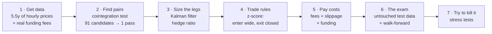
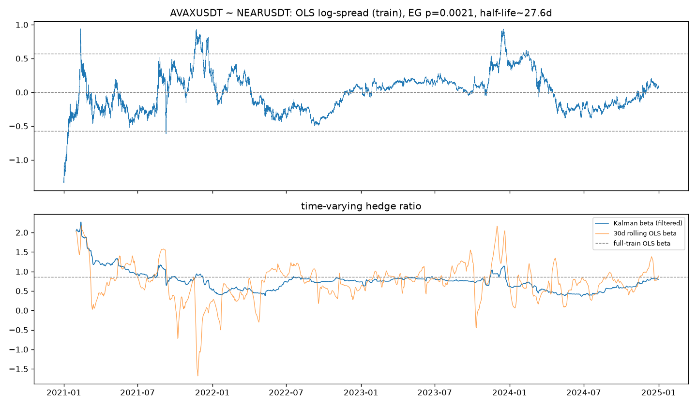
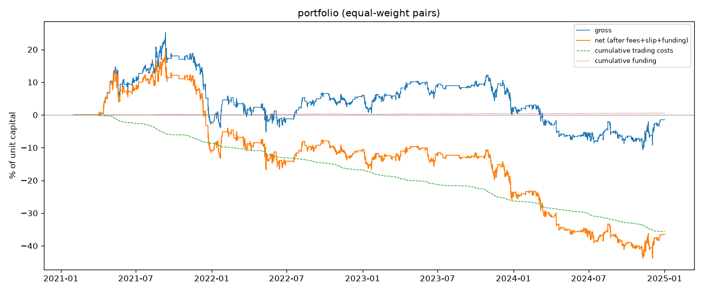

# crypto-statarb

**A from-scratch test of the most famous "market-neutral" trading strategy — pairs
trading — on crypto, and then on US stocks. Spoiler: honest testing kills most of it,
and that's the point.**

This README assumes you've never heard of pairs trading. Every term in *italics* is
explained the first time it appears, and there's a [jargon table](#jargon-translator)
at the bottom.

---

## The idea in plain English

Imagine two coins that usually move together — like a dog on a leash. Each one
wanders randomly, but the *distance between them* keeps snapping back.

Pairs trading bets on the leash, not the dog:

1. Find two assets whose price gap historically snaps back to normal.
2. When the gap gets unusually wide, **short the expensive one, buy the cheap one**.
3. When the gap closes, exit. You never bet on the market going up or down — only
   on the gap closing. That's what *market-neutral* means.

Sounds easy. The catch: it's also the easiest strategy in the world to fool yourself
with. Random pairs *look* connected if you stare at enough of them, backtests
quietly cheat by peeking at the future, and trading fees eat edges this small.

## So what is this repo actually?

**A research project about not fooling yourself.** The question isn't "can I make a
profitable backtest?" (anyone can — that's the trap). It's:

> Does a textbook pairs-trading strategy on crypto still work after you pay real
> costs, ban every form of peeking at the future, and judge it only on data it has
> never seen?

The headline answer, reported honestly:

| Experiment | Net profit | Sharpe* | Worst drop |
|---|---|---|---|
| **Training data** (strategy tuned here — grade inflated by design) | +30.8% | +0.59 | −18.7% |
| **Test data** (2025 → mid-2026, never touched during development) | **+4.0%** | **+0.27** | −16.9% |
| **Fully automated version** (no human choices at all) | **−30.2%** | −0.69 | −47.1% |
| Just holding BTC over the same test period | −22.9% | −0.33 | — |

*\*Sharpe ratio = return per unit of risk. Rule of thumb: below ~0.5 is weak, 1+ is good, 2+ is great.*

**Reading the table:** the strategy made a small real profit while BTC crashed — nice.
But the profit shrank 8× outside the training data, and the version with no human
judgment *lost* 30%. The gap between those rows is the actual research result.


---

## How it works, step by step



### Step 1 — Get clean data

5.5 years (2021 → mid-2026) of hourly prices for 14 liquid crypto *perpetual futures*
from Binance, stored in Postgres. Two honesty rules baked in:

- A price bar that's still forming is never stored (it can still change — using it
  is a subtle form of peeking).
- Missing data is recorded as missing, never filled in with guesses.

*Funding* — the periodic payment between long and short holders of a perp — is
stored as the **actual historical payments**, because for this strategy it's a real
cost/income stream, not a footnote.

### Step 2 — Find pairs that are actually connected

Two prices being correlated is not enough — almost everything in crypto moves
together. The strategy needs *cointegration*: a statistical test (Engle–Granger)
that asks "does the gap between these two keep returning to a stable level?"

- All **91 possible pairs** from the 14 coins were tested — on training data only.
- Result: **only 1 pair passed cleanly** (AVAX/NEAR). Correlation is everywhere;
  real connectedness is rare.
- Honesty check: testing 91 pairs at a 5% significance level means **~4.5 pairs
  would pass by pure luck**. So even the winner might be a fluke — only the test
  data can tell.

The traded book took the screen's top three (AVAX/NEAR, ADA/DOT, ADA/LTC) under
slightly relaxed rules — a human judgment call, recorded in `DECISIONS.md`. Remember
this detail; it becomes the plot twist later.



### Step 3 — Decide how much of each coin (the hedge ratio)

If you buy $1 of AVAX, how much NEAR do you short so that market moves cancel out?
That number (*beta*, the hedge ratio) drifts over time, so it's estimated with a
*Kalman filter* — a standard algorithm that updates its estimate a little with each
new price, instead of assuming one fixed number forever.

Anti-cheating rule: today's gap is always measured with **yesterday's** estimate.
Using today's would smuggle today's price into its own trading signal.

### Step 4 — The trading rules

The gap is standardized into a *z-score*: "how unusual is today's gap, in standard
deviations, vs the last 60 days?" Then three simple rules:

| Rule | Meaning |
|---|---|
| Enter when \|z\| ≥ 2.5 | the gap is unusually wide — bet on it closing |
| Exit when \|z\| ≤ 0.5 | the gap has closed — take the profit |
| Stop out at \|z\| ≥ 4.0 | the gap is *so* wide the relationship may be broken — get out |

One more anti-cheating rule: a signal computed at 3pm trades at **4pm**, never at
3pm. A price bar can never buy itself.


### Step 5 — Pay real costs

Every trade pays exchange fees (5 bps) + price impact (2 bps) per leg, plus the
actual historical funding payments. The accounting is exactly additive —
`net = gross − fees − slippage + funding` — so you can always see what ate the profit.

This matters more than it sounds: costs run **~4–5% of capital per year**, the same
size as the edge itself. The chart below shows gross profit vs what's left after costs:



### Step 6 — The exam (this is the whole point)

All parameters were tuned **only on 2021–2024 data**, choosing from a grid of 72
pre-declared combinations (declaring them upfront prevents endless "just one more
tweak" fishing). Then, two exams:

**Exam A — the frozen split.** Run the tuned strategy on 2025 → mid-2026, data it
had never seen. Result: profit shrank from +30.8% to **+4.0%**, Sharpe from +0.59
to +0.27. Real, but thin.


**Exam B — the walk-forward.** Rebuild *everything* automatically every quarter —
re-pick pairs, re-tune parameters, no human involved — and only count profits on
each quarter it hadn't seen yet. Result: **−30.2% over 3.5 years.**


**The uncomfortable conclusion:** the only version that made money is the one where
a human hand-picked the pairs (Step 2's judgment call). The fully automated version
loses. So whatever edge exists lives in the one step that can't be validated
statistically.

### Step 7 — Try to kill the result (stress tests)

A +4% result this thin deserves hostility. Each test below is a different way of
asking "was it luck?":

| Stress test | Question | Answer |
|---|---|---|
| Double the fees | Would slightly worse execution kill it? | **Yes.** +4.0% → −0.2% at 2× costs |
| Compare all 72 parameter combos | Did tuning actually find skill? | **Mostly luck.** Train vs test ranking correlation: +0.10 (≈ random). The best test combo had a *negative* training score |
| Remove one pair at a time | Was it one lucky pair? | **Yes.** Without ADA/LTC: −0.24% |
| Split by market direction | Truly market-neutral? | **No.** +11.5% when BTC trended up, −7.2% when down |
| Re-test cointegration each year | Was the "connection" stable? | **No.** The pairs pass the test in only 5–11% of rolling 1-year windows |


The full hand-written post-mortem: [`reports/m7_failure_analysis.md`](reports/m7_failure_analysis.md).

---

## Round 2: the same experiment on US stocks

Everything above screams "crypto is a bad neighborhood for this." So the entire
pipeline was re-run on **24 large US stocks** (banks, oil, semiconductors, payments…,
276 pairs, daily bars, same dates) — with three predictions written down and
committed to git *before* touching any stock data, and with the pair selection made
**fully mechanical** this time (removing the human judgment step on purpose).

| Prediction | What happened |
|---|---|
| More stock pairs will pass the cointegration test than crypto's 1/91 | Yes — 13/276. But ~13.8 would pass by luck, so it's *exactly* the luck rate |
| Stock relationships will be more stable than crypto's | **Wrong.** They passed the rolling 1-year re-test in 0–4% of windows — *worse* than crypto's 5–11% |
| More cointegration ≠ more profit (pairs trading in stocks is a 40-year-old crowded trade) | Supported, the interesting way — see below |

The stock test window printed **+13.7% (Sharpe +1.02)** — better than training! But
the diagnostics take it apart: 97% of *all* parameter combos were profitable in that
window (a rising tide, not a found edge), the one economically sensible pair
(Mastercard/Visa) actually **lost** money while two statistical accidents earned
everything, and **just buying the S&P 500 beat the strategy anyway** (+29.6%,
Sharpe +1.11).

The cleanest cross-market fact: the automated walk-forward went from **−30.2%**
(crypto) to **+3.3%** (stocks). Stock trading costs are ~10× smaller, so the
strategy stops bleeding — but it still earns roughly nothing.


Full comparison: [`reports/m10_crossasset.md`](reports/m10_crossasset.md).

---

## What I'd tell you over coffee

- **Cointegration is rare and unstable** — in both markets, the pairs that pass a
  4-year test almost never pass any individual year. You're chasing an average that
  rarely exists in the present.
- **Costs decide everything in crypto; signal decides everything in stocks.** The
  crypto edge dies at 2× fees; the stock edge survives 3× fees but barely exists.
- **One good out-of-sample number proves very little.** The stock study's Sharpe
  +1.02 looks great until you notice the whole parameter grid was profitable and
  the index did better.
- **The honest deliverable is the gap** between the tuned backtest and the untouched
  test — not the backtest itself. Anyone showing you only the first number is
  selling something.

**Known limitations** (all documented in the reports): only coins/stocks that still
exist today could enter the universe (survivorship bias), hourly/daily bars can't
see intrabar spikes, no margin/liquidation modelling, and 91 or 276 statistical
tests guarantee some lucky passes.

---

## Jargon translator

| Term | Plain English |
|---|---|
| Statistical arbitrage ("stat arb") | Betting on statistical patterns between prices, not on news or fundamentals |
| Perpetual future ("perp") | A crypto contract that tracks a coin's price and never expires; the main way to short crypto |
| Funding rate | Periodic payment between longs and shorts that keeps a perp glued to the spot price |
| Cointegration | Two prices whose *gap* keeps returning to a stable level (the dog-on-a-leash property) |
| Hedge ratio / beta | How much of asset B offsets $1 of asset A |
| Kalman filter | An algorithm that keeps updating an estimate (here: the hedge ratio) as new data arrives |
| Z-score | "How unusual is this value?" measured in standard deviations from recent average |
| Slippage | The price moves against you while your order executes |
| Sharpe ratio | Return divided by volatility — return per unit of risk taken |
| Drawdown | The worst peak-to-bottom loss along the way |
| In-sample / out-of-sample | Data used to build the strategy / data held back to grade it honestly |
| Walk-forward | Repeatedly re-building the strategy on the past and grading it on the next unseen chunk |
| Look-ahead bias | Any leak of future information into a past decision — the #1 way backtests lie |
| Survivorship bias | Only assets that survived until today are in your data, which flatters history |

---

## Run it yourself

```bash
cp .env.example .env   # local Postgres credentials
make all               # crypto study: ingest → tests → every table and figure (~3h)
make all-equities      # stock study: same pipeline, runs in minutes
```

Requires Docker (Postgres 16 on host port 5433), [uv](https://docs.astral.sh/uv/), Python 3.11+.
Every number and chart in this README regenerates from raw exchange data — nothing
is hand-picked from a bigger search. 70 tests guard against look-ahead bias, including
"mutate the future" tests: change data after time T and assert nothing before T changes.

## Where everything lives

| Path | What it is |
|---|---|
| `SPEC.md` | The project's rules of engagement, written before the code |
| `DECISIONS.md` | Every methodology choice + why, in chronological order |
| `config.yaml` / `config_equities.yaml` | Every parameter, pre-declared — nothing tunable hides in code |
| `src/` | The pipeline, one package per stage (ingest → pairs → signals → backtest → validate → metrics → report) |
| `reports/` | Auto-generated result tables + hand-written analysis per milestone |
| `reports/m7_failure_analysis.md` | **The honest post-mortem — best single read** |
| `M10_PLAN.md` → `reports/m10_crossasset.md` | The stock replication: predictions first, verdicts after |
| `tests/` | 70 tests; the look-ahead guards are the interesting ones |
